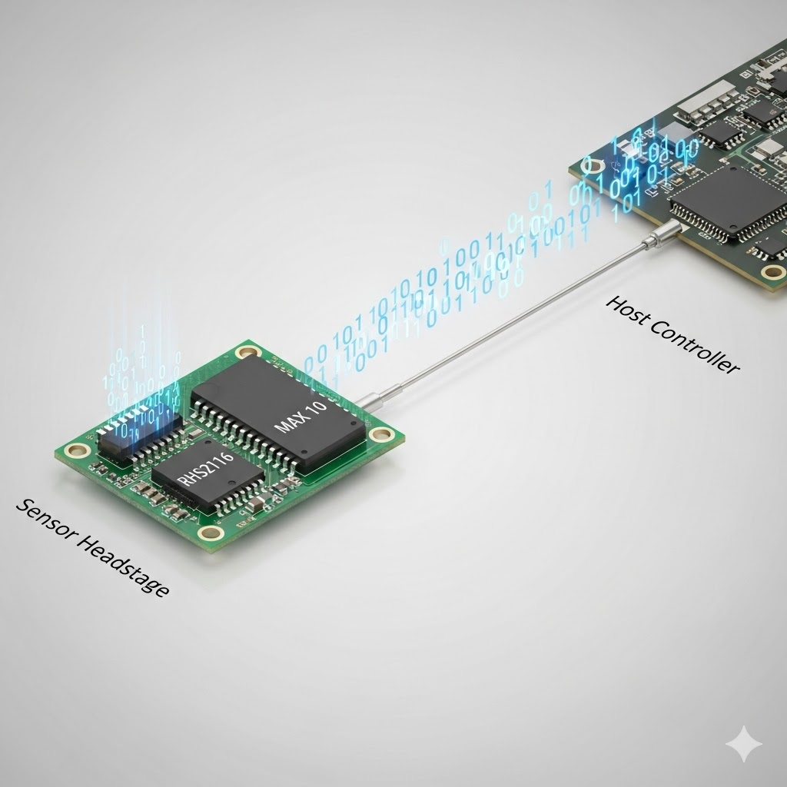
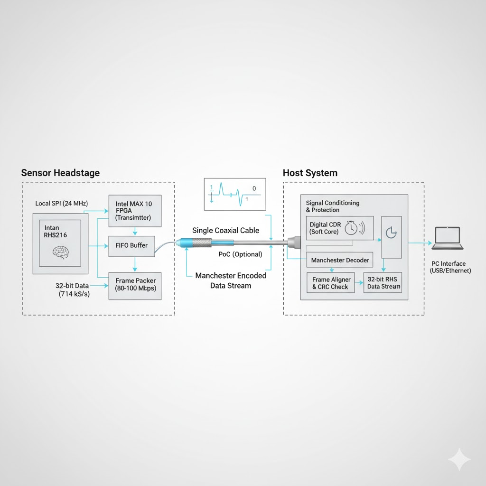

# RHS2116 单线数字链路系统



[English](README.md) | [中文](README_CN.md)

## 📖 简介

本项目提供了一套完整的基于 FPGA 的单线数字链路解决方案，用于通过单根同轴电缆传输 RHS2116 SPI 传感器数据。系统采用曼彻斯特编码（Manchester Encoding）并支持同轴供电（PoC），实现了在单根线缆上同时进行可靠的数据传输和供电。该系统专为高速、低延迟应用设计，可在 1-3 米的同轴电缆上实现 22.85 Mbps 的有效载荷数据速率。

---

## ✨ 主要特性

| 特性 | 规格 | 说明 |
| :--- | :--- | :--- |
| **有效载荷速率** | 22.85 Mbps | 714 kS/s × 32-bit |
| **线路速率** | 50 Mbps (Manchester) | 100 MHz 符号率 |
| **帧格式** | 56-bit | 同步字 + 计数器 + 数据 + CRC校验 |
| **传输距离** | 1-3 米 | 同轴电缆 |
| **时钟架构** | 多时钟域 | 64MHz SPI, 100MHz Sys, 200MHz CDR |
| **供电** | PoC 支持 | 支持同轴供电 |

---

## 🏗️ 系统架构



### 发送端（传感器端）
发送端通过 SPI 接口连接 RHS2116 传感器，数据经过异步 FIFO 缓冲，打包成带有 CRC 校验的帧，最后进行曼彻斯特编码并通过同轴电缆发送。

`RHS2116 → SPI Master (64MHz) → Async FIFO → Frame Packer (100MHz) → Manchester Encoder → Coax`

### 接收端（远端）
接收端通过软 CDR（时钟数据恢复）模块从输入信号中恢复时钟和数据，进行帧同步，通过 CRC 验证数据完整性，最终输出解码后的 SPI 数据。

`Coax → CDR (200MHz) → Frame Sync (100MHz) → Async FIFO → Data Output`

---

## 🛠️ 开发环境

编译和仿真本项目需要以下工具：

### FPGA 开发
*   **IDE**: Intel Quartus Prime (Standard or Lite Edition)
*   **目标器件**: Intel MAX 10 FPGA
*   **语言**: Verilog HDL (IEEE 1364-2001)

### 仿真验证
*   **仿真器**: [Icarus Verilog (iverilog)](http://iverilog.icarus.com/)
*   **波形查看器**: [GTKWave](http://gtkwave.sourceforge.net/)
*   **Testbench**: 位于 `testbench/` 目录下。

### 推荐配置
```bash
# macOS 安装 (通过 Homebrew)
brew install iverilog gtkwave

# Ubuntu/Debian 安装
sudo apt-get install iverilog gtkwave
```

---

## 🔩 硬件与 BOM

> **注意**: 完整的 PCB 设计文件和详细 BOM 将在后续更新中提供。

### 核心组件
1.  **FPGA**: Intel MAX 10 系列 (如 10M08 或 10M16)
    *   选用其瞬时启动能力和集成 ADC/Flash 特性。
2.  **传感器**: Intan RHS2116
    *   数字电生理刺激/记录芯片。
3.  **接口**: SMA 或 BNC 连接器
    *   用于稳固的同轴电缆连接。
4.  **线缆**: 50Ω 同轴电缆 (RG174 或类似)
    *   阻抗匹配对信号完整性至关重要。

---

## 🚀 快速开始

### 1. 克隆仓库
```bash
git clone https://github.com/your-repo/spi-coax.git
cd spi-coax
```

### 2. 运行仿真
本项目提供了系统级 Testbench 以验证完整链路（编码器 + 解码器）。

```bash
# 使用 iverilog 编译并运行
cd testbench
iverilog -o sim_system tb_spi_coax_system.v ../*.v
vvp sim_system

# 查看波形
gtkwave dump.vcd
```

### 3. 构建项目
在 Quartus Prime 中打开项目并针对您的 MAX 10 目标器件进行编译。请确保正确应用时序约束（SDC），特别是对于 200MHz CDR 时钟域。

---

## 📂 项目结构

```text
spi-coax/
├── assets/                 # 图片和视觉资源
├── docs/                   # 详细文档
├── testbench/              # 仿真 Testbench
├── spi_master_rhs2116.v    # SPI 主控制器
├── rhs2116_link_encoder.v  # 发送端顶层
├── rhs2116_link_decoder.v  # 接收端顶层
├── frame_packer_100m.v     # 帧打包与 CRC
├── manchester_encoder_100m.v # 曼彻斯特编码器
├── cdr_4x_oversampling.v   # 时钟数据恢复
├── frame_sync_100m.v       # 帧同步
└── top.v                   # 系统回环顶层
```

---

## 📄 许可证

本项目采用 MIT 许可证。详情请参阅 [LICENSE](LICENSE) 文件。
